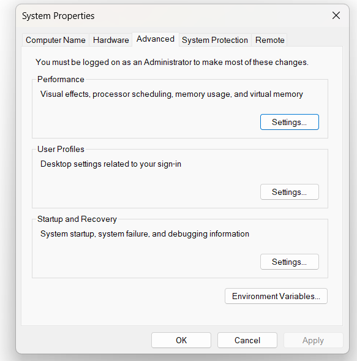
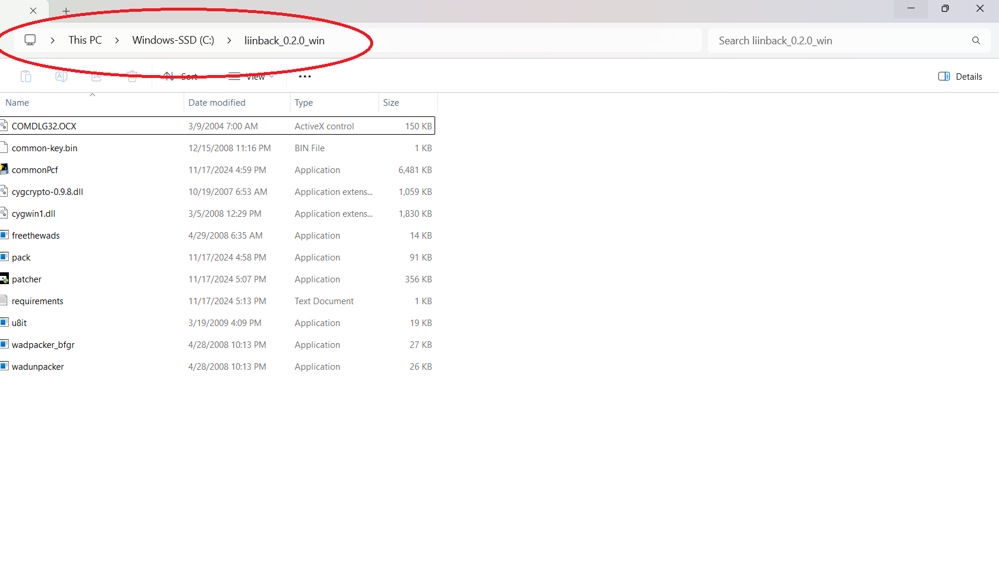

Greetings, so you want to get started with local-hosting Liinback on your Nintendo Wii? Okay, you are in the right spot there buddy!
This is a guide on how to do so, so you can start using the discountinued YouTube application on your Nintendo Wii again like those days
before it got shutdown 7 years ago. Here are the requirements that you are going to need:

A computer like a Mac OS, Windows, or Linux.
Python (Latest)
ffmpeg
ffdec/JPEXS, a Flash decompiler
Liinback Patcher (Windows)
WiiWare Patcher (Windows)
A Wii, Dolphin, or Wii U (that includes it's vWii mode)
A working internet connection

Step 1, setting up Python:

Visit this URL page here: https://www.python.org/downloads/, and start downloading the installer on your computer and save it somewhere on your drive, then open the installer in either a file explorer or in your desktop (If you have the installer placed in your desktop).
For windows users, check these at the bottom of the installer window:

• Use admin privileges when installing
• Add python to PATH

After you have check those, click on -> "Customize installation". You will be navigated to the optional features section and check these:

• Documentation
• pip
• tcl/tk and IDLE
• Python test suite
• py launcher
• for all users (requires admin privileges)

After you have checked 6 of these features, click on -> "Next",  and you will be navigated to the advanced options.
Check these as well:

• Install Python for all users
• Associate files with Python (requires the 'py' launcher)
• Create shortcuts for installed applications
• Precompile standard library
• Download debugging symbols
• Download debug binaries (requries VS 2017 or later)
• Download free-threaded binaries (experimental)

Then click on -> "Browse", go to "This PC",  "Windows-SSD (C:)", select "Windows-SSD (C:)", click on -> "Make New Folder" at the bottom, and name the folder, "Python", click on -> "OK" and finally, click on -> "Install".
If the window, displays, "Do you want to allow this app to make changes to your device?", just click on -> "Yes", and then Python will start installing.

Once Python is installed, click on -> "OK" or "Cancel".

Step 2, setting up ffmpeg:

Visit this URL page here: https://www.ffmpeg.org/. At the right middle, click on -> "Download", look for the "Get packages & executable files" section at the left middle and select your platform (type of computer/operation system) you're using right now and at the bottom will have buttons or a button that links you to a URL page on where you can download ffmpeg on your platform.

For Linux users please watch this video guide/tutorial on how set it up:
https://www.youtube.com/watch?v=bNP9LY8rwSQ
For Mac OS users please watch this video guide/tutorial on how set it up:
https://www.youtube.com/watch?v=dJ8y-VlMNAo

For Windows users, follow my guide here on how to setup ffmpeg.
I recommend you click on -> "Windows builds by BtbN" and will take you to BtbN's github build releases page.
Make you sure download the latest version of it and the "ffmpeg-master-latest-win64-gpl.zip" archive.
After you have downloaded it, I recommend that you visit this URL page here and get WinRAR:
https://www.rarlab.com/download.htm
For Windows and x64 users, in the "Latest WinRAR and RAR beta versions", select the "x64" type, and download it.
Open the installer and click on -> "Install", and then WinRAR should start installing on your Windows.

After that's done, go to your directory on where you have downloaded the ffmpeg ZIP archive, right click on the ZIP archive, select WinRAR, open with WinRAR, click on the -> "ffmpeg-master-latest-win64-gpl" folder, click on the -> "bin" folder, at the top, click on -> "Extract to", -> "This PC", -> "Windows (C:)". At the top right corner, click on -> "New folder" and name it to "ffmpeg", click on the folder you just created and click on -> "OK", and WinRAR will extracting the binaries to the ffmpeg folder.

After that's done, close out WinRAR.

At the bottom of your taskbar, click on your search bar and type: edit system enviroment variables, click on that button in the search results.

At the bottom right, click on -> "Enviroment Vairables..."

In the system variables section, scroll down until you see the variable, -> "Path".
Select -> "Path" and at the bottom right, click on -> "Edit". Click on -> "New", and type in:
C:\ffmpeg
Click on -> "OK", click on "OK" again, and click on that same button, and there. You have finished setting up ffmpeg.

Step 3, setting up the server:

At the bottom of your taskbar, click on your search bar and type: cmd
then open it and type: cd C:/{where ever your liinback directory as at}, for example if your Liinback is located at:
C:/Liinback, then do:
cd C:/Liinback
and then do:
python app.py
and you will get this display in the cmd/command prompt:
What port should Liinback run on?
CAUTION: The maximum number port the Wii runs is port 443:

I recommend you do either port 80 or 443.

After you're done inputing the port number, then you will get this display:

Are you using [dev] or [prod]?

If you just want to use local-host, then do:
dev

After that's done, then you will get this display:

Please enter your IP address:

Now listen, it's not talking about your real IP address on where you live, it's talking about what's your computer's IP address, okay?
So don't panic. In order to get the IP address, at the bottom of your taskbar, click on your search bar and type: cmd
then in the cmd/command prompt, type:
ipconfig
In the, "Wireless LAN adapter Wi-Fi" section, the "IPv4 Address. . . . . . . . . . . :" includes your IP address, go back to the other cmd window on where you have the app.py running and type in your IPv4 address.

After that's done, you will get this display and more than just this:
"Building your configuration file"
But also the other Python libraries such as flask, colorama, and requests will start installing on your computer, and once they're done
installing, you will get this display:

Required-by:
 * Serving Flask app 'app'
 * Debug mode: on
WARNING: This is a development server. Do not use it in a production deployment. Use a production WSGI server instead.
 * Running on http://{Your IPv4 address}:{Your port number}
Press CTRL+C to quit
 * Restarting with stat
 * Debugger is active!
 * Debugger PIN: 288-693-517

Step 4, patching the YouTube channel:

Download the Liinback Patcher from Liinback's github releases page:
https://github.com/RedFireMRT84/Liinback-Patcher/releases/tag/liinbackPatcher

Remember the steps, download it, extract it somewhere, and open the "patcher.exe"
After that, go back to your Liinback instance, copy the "configuration.xml" file and paste it in your Liinback patcher directory, then go back to the patcher.exe and press enter and do the rest of the instructions thats on the screen.

For the region free, if your Nintendo Wii is not in NTSC-U (American), then you need to region-free the WAD. The "wadOutput" or "outputWad" folder is where your patched WAD is located.

Next, we are going to do patch number 2, which is patching the .swf files:

wii_shim
wii_dev_shim

Go ahead and go to the output wad folder, copy the WAD, and paste it in your patcher's directory, and delete the temp, wadInput, and the
base_020.wad. Rename the "output.wad" or "output_rf.wad" to -> "unpack.wad", at the top middle, you will see this:

Click on that on where you see the circle, and type in:
cmd

then in the cmd/command prompt window, type:

wadunpacker.exe unpack.wad

and the WAD will start unpacking, after that's done, go to the "00010001*" folder, copy the "00000002.app" file and paste it in your Liinback patcher directory, go back to that command and type:
u8it 00000002.app 00000002_app_OUT
after the "00000002.app" is unpacked, now that's where you need to get the Flash decompiler, here you go: 
https://github.com/jindrapetrik/jpexs-decompiler/releases

After you have JPEXs installed, open the program, and at the top left corner, click on -> "Open" and go to your Liinback

go to your Liinback patcher directory, and the 00000002_app_OUT/trusted, directory and click on the "wii_shim" file
Make sure you go to -> scripts -> com.google.youtube.tv.wii.shim.ShimBase class, click -> "Edit" and replace:
https://www.youtube.com/wiitv to:
http://{Your IPv4 address}:{Your port number}/wiitv
Replace:
https://www.youtube.com/s/tv/wii/config to:
http://liinback2.atspace.tv/label_extension
And save the wii_shim file, open the "wii_dev_shim" with JPEXs and do the same thing like you did with the "wii_shim".
After that's done, go ahead and save the "wii_dev_shim" as well, and click at the top "Close all".
Then back to packing the WAD, go back to the cmd/command prompt on where you have unpacked the "00000002.app", and type in the command:
u8it 00000002_app_OUT 00000002.app -pack
After that's done, copy the "00000002.app" and paste it back to the "00010001*" folder, then copy all of the files from the "00010001*" folder and paste it in your Liinback patcher, then go back to the command prompt and type:
wadpacker_bfgr.exe *.tik *.tmd *.cert output_.wad -sign

After your modified WAD has been packed, go and get the WiiWare patcher:
https://github.com/RiiConnect24/WiiWare-Patcher/releases
Copy the WiiWarePatcher.bat file and paste it in your Liinback patcher folder and start the program, enter 1, and also 1 for "Patch for normal games" and then your "output_.wad" will start patching. Your patched wad, "output_.wad" will be in the "wiimmifi-wads" folder.

Make sure you have your Nintendo Wii homebrewed, if you don't. Follow this guide:
https://www.youtube.com/watch?v=zGkjuqh0YHI
Wii U users:
https://www.youtube.com/watch?v=w44Iz3HQuIo
Dolphin users:
https://www.youtube.com/watch?v=WUJeCy6QP8Q

Step 5, patching the "leanbacklite_wii" and the 2 "apiplayer" SWF files:

First open the leanbacklite_wii.swf in JPEXs. At the top, you will see the "Tools" button. Click on that, then click on "Text search".
Make sure that the "Current SWF" is selected as a scope, and type in the input:
192.168.1.192:443
And you're going to replace, "192.168.1.192:443" to your IPv4 address and port number you have running in your Liinback instance server.
You can take a look at your configuration.xml file to find your IPv4 address and port number.
After you're done modifiying the "leanbacklite_wii", do the same thing with the 2 "apiplayer":
apiplayer
apiplayer-vflZLm5Vu
And bam, you're done setting up your own Liinback instance.
Please note that the video player isn't that great, check the "README" text for more information about Liinback.
